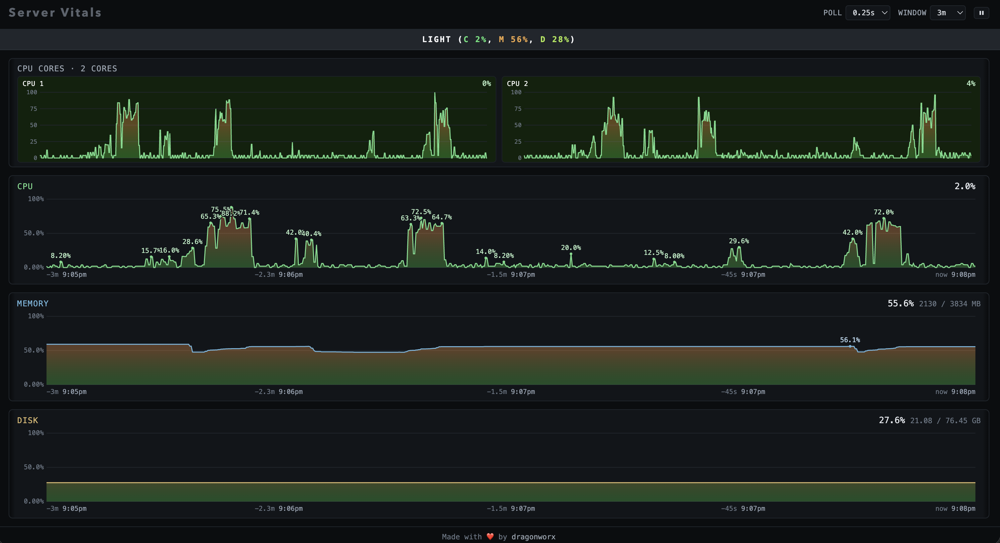
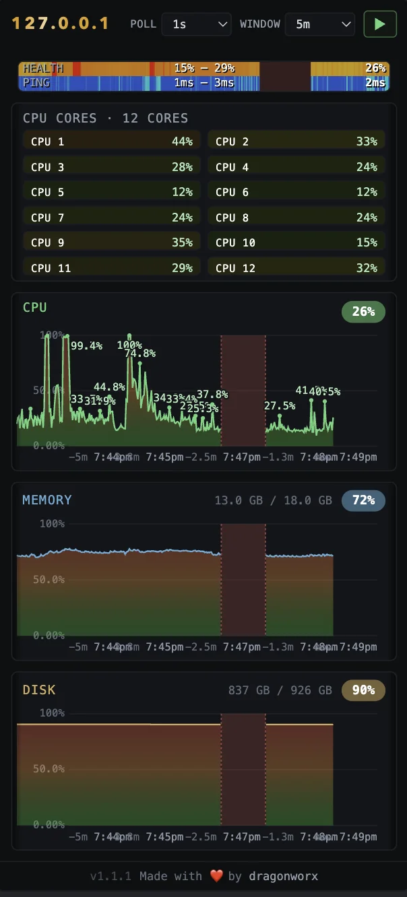

# Server Vitals

A tiny, dependency-free server health endpoint. One Python file, standard
library only — no pip installs, no virtualenv. It exposes a few JSON health
endpoints and a self-contained live **stats dashboard** (CPU incl. per-core,
memory, disk) that you can drop behind nginx or hit directly.

**Runs on Linux _and_ macOS** — the same file. On Linux it reads `/proc`; on a
Mac it reads the Mach kernel and `sysctl` instead (still zero-dependency, still
stdlib only), so you can also point it at your laptop. See
[Run on macOS](#run-on-macos).

Built for a single VPS: it listens on `127.0.0.1:9999` and is meant to be
reverse-proxied at paths like `/health` and `/stats` — or, on your own machine,
just opened straight in a browser with no proxy at all.

<p align="center">
  
  <br>
  <em>Desktop view</em>
  <br>
  <br>
  
  <br>
  <em>Mobile Portrait View</em>
</p>

## Endpoints

| Path           | Returns                                                                 |
| -------------- | ----------------------------------------------------------------------- |
| `/health`      | JSON: cpu, memory, disk, load average, uptime, overall `ok/degraded`    |
| `/stats`       | HTML live dashboard (polls `/stats?format=json`)                        |
| `/stats?format=json` | JSON sample: cpu %, **per-core cpu %**, memory, disk             |

The `/stats` dashboard is a single HTML page with no external assets. It draws
CPU (with one mini-graph per core, auto-detected), memory, and disk as live
SVG sparklines. Poll interval (0.25s–10s) and time window (1–60 min) are
selectable from the header and persisted in `localStorage`.

## Requirements

- `python3` (standard library only — works with the system Python on both OSes)
- **Linux** with `/proc` (reads `/proc/stat`, `/proc/meminfo`, `/proc/uptime`),
  or **macOS** (reads the Mach host port + `sysctl` via `ctypes` — no extra install)
- For the managed service: `systemd` on Linux (or `launchd` on macOS) — and
  optional `nginx` / Caddy if you want to reverse-proxy it

## Why a systemd service, not a Docker container

Server Vitals is a **host-monitoring agent**, so it is deployed as a plain process
under systemd — *not* in a container. This is deliberate. The whole job of the
app is to observe the host it runs on:

- It reads the host kernel directly: on Linux `/proc/stat`, `/proc/meminfo`,
  `/proc/uptime`, and `statvfs("/")`; on macOS the Mach host port
  (`host_processor_info`, `host_statistics64`) and `sysctl` — for CPU / memory /
  load / disk.

A container's value is **isolation** — its own filesystem, PID namespace, and
network stack, separate from the host. That is exactly the wrong default here:

| Concern | systemd service (this project) | Docker container |
| --- | --- | --- |
| Sees real host CPU / mem / disk | ✅ directly | ❌ sees the container namespace unless you bind-mount `/proc`, `/`, … |
| Lifecycle / autostart / restart | systemd (`enable --now`, `Restart=`) | Docker daemon (`restart: unless-stopped`) |
| Footprint | ~none — one stdlib Python process | image build + daemon overhead |

To run Server Vitals usefully in a container you would have to dismantle that
isolation (`--pid=host`, `-v /proc:/host/proc:ro`, `-v /:/rootfs:ro`) **and**
rewrite the metric paths to read `/host/proc/*` — more moving parts for a
strictly less capable result. So it ships as a service. Containers remain the
right tool for workloads you want *isolated from* the host (web apps,
databases); a host agent is the opposite case.

> If you genuinely need it containerized anyway (e.g. a constrained PaaS), run
> with `--pid=host --network=host` and bind-mount `/proc` and `/` read-only.

## Install

**From a checkout** (recommended):

```bash
git clone https://github.com/dragonworx/server-vitals.git
cd server-vitals
sudo ./install.sh            # or: make install
```

Add `--with-nginx` to also install the reverse-proxy snippet:

```bash
sudo ./install.sh --with-nginx
```

**One-liner** (fetches the sources straight from GitHub):

```bash
RAW=https://raw.githubusercontent.com/dragonworx/server-vitals/main
curl -fsSL $RAW/install.sh | VITALS_RAW_BASE=$RAW sudo -E bash
```

The installer copies `server-vitals.py` to `/usr/local/bin`, installs the
`server-vitals` systemd unit, enables + starts it, and verifies `/health`
responds.

### install.sh options

| Option          | Effect                                                |
| --------------- | ----------------------------------------------------- |
| `--with-nginx`  | also install `nginx/server-vitals.conf` and reload nginx     |
| `--no-start`    | install files but don't enable/start the service      |
| `--user USER`   | run the service as `USER` (default `www-data`)        |

## nginx integration

The snippet at [`nginx/server-vitals.conf`](nginx/server-vitals.conf)
proxies `/health` and `/stats` to `127.0.0.1:9999`. After
installing it (`--with-nginx`), `include` it in any server block:

```nginx
server {
    # ...
    include snippets/server-vitals.conf;
}
```

Then `sudo nginx -t && sudo systemctl reload nginx`.

## Caddy integration

For [Caddy](https://caddyserver.com), proxy `/health` and `/stats` to
`127.0.0.1:9999` in your `Caddyfile`:

```caddy
example.com {
    # ...
    reverse_proxy /health 127.0.0.1:9999
    reverse_proxy /stats 127.0.0.1:9999
}
```

Then `sudo caddy validate && sudo systemctl reload caddy`.

## Security

The endpoints have **no built-in authentication** — they expose host CPU,
memory, disk, load, and uptime, which is reconnaissance-grade information. The
server only binds `127.0.0.1`, so it is not reachable from outside the box until
*you* reverse-proxy it. When you do, restrict access at the proxy:

- The shipped [`nginx/server-vitals.conf`](nginx/server-vitals.conf) snippet is
  locked to `allow 127.0.0.1; deny all;` by default — widen the allowlist to your
  office/VPN range, or add `auth_basic`, before exposing it publicly.
- For Caddy, gate the routes with `@allowed` matchers or `basic_auth`.

Other hardening already in place: the service runs as an unprivileged user under
a locked-down systemd unit (`NoNewPrivileges`, `ProtectSystem=strict`,
`ProtectHome`, `PrivateTmp`); requests are read-only `GET`s; idle/slow client
connections are dropped after a short timeout; and internal errors return a
generic message (details go to the journal, never the client).

## Run locally (no install)

```bash
make run          # python3 server-vitals.py — serves on 127.0.0.1:9999
```

Open <http://127.0.0.1:9999/stats>.

## Run on macOS

The same `server-vitals.py` monitors a Mac — your laptop included. There's
**nothing extra to install** (it uses the system `python3` and `ctypes`; no
Homebrew, no pip) and **no web-server config to set up locally**: the script is
itself the HTTP server, so you hit its port directly.

```bash
git clone https://github.com/dragonworx/server-vitals.git
cd server-vitals
make run          # python3 server-vitals.py — serves on 127.0.0.1:9999
```

Then open <http://127.0.0.1:9999/stats> in your browser, or curl the JSON:

```bash
curl -s http://127.0.0.1:9999/health | python3 -m json.tool
```

That's the whole story for a laptop you're watching live — nginx/Caddy are only
needed when you want to *expose* it on a remote box behind a path like `/stats`.
The systemd-specific `make` targets (`start`/`stop`/`deploy`…) don't apply on
macOS; use `make run` for a foreground process.

> **Keep it running in the background (optional).** To have launchd start it at
> login and respawn it if it dies, drop a user agent at
> `~/Library/LaunchAgents/com.dragonworx.server-vitals.plist` (adjust the path to
> your checkout), then `launchctl load` it:
>
> ```xml
> <?xml version="1.0" encoding="UTF-8"?>
> <!DOCTYPE plist PUBLIC "-//Apple//DTD PLIST 1.0//EN"
>   "http://www.apple.com/DTDs/PropertyList-1.0.dtd">
> <plist version="1.0"><dict>
>   <key>Label</key>            <string>com.dragonworx.server-vitals</string>
>   <key>ProgramArguments</key> <array>
>     <string>/usr/bin/python3</string>
>     <string>/Users/YOU/server-vitals/server-vitals.py</string>
>   </array>
>   <key>RunAtLoad</key>        <true/>
>   <key>KeepAlive</key>        <true/>
> </dict></plist>
> ```
>
> ```bash
> launchctl load ~/Library/LaunchAgents/com.dragonworx.server-vitals.plist
> # stop later with: launchctl unload ~/Library/LaunchAgents/com.dragonworx.server-vitals.plist
> ```
>
> It still binds `127.0.0.1:9999` only, so nothing is reachable off your Mac.

## Manage

```bash
make start        # start the service
make stop         # stop the service
make restart      # restart (no code redeploy)
make deploy       # rebuild: reinstall current server-vitals.py + restart
make status       # systemctl status
make logs         # journalctl -u server-vitals -f
make check        # py_compile the source
```

Use `make restart` to bounce the running service; use `make deploy` after
editing `server-vitals.py` to push the new code and restart in one step.

## Uninstall

```bash
sudo ./uninstall.sh                 # remove service + binary
sudo ./uninstall.sh --purge-nginx   # also remove the nginx snippet
```

## Configuration

Knobs live at the top of `server-vitals.py`:

- `LISTEN` — bind address/port (default `127.0.0.1:9999`)
- `SAMPLE_INTERVAL` — seconds between background CPU samples (default `0.25`)
- `REQUEST_TIMEOUT` — seconds before an idle/slow client connection is dropped
  (default `5`)

After editing, run `make deploy` to push the new code and restart (or
`make restart` if you only need to bounce the running service).

## License

MIT — see [LICENSE](LICENSE).

---

<p align="center">Made with ❤️ by dragonworx</p>
